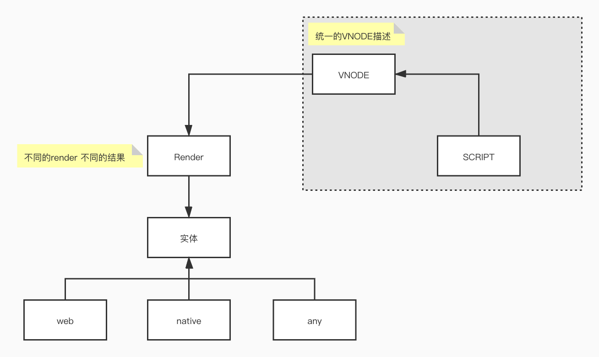
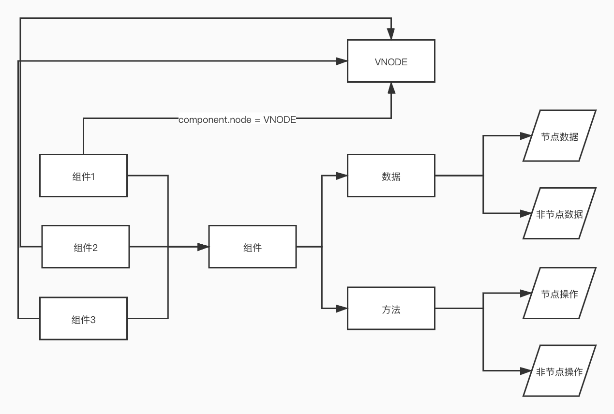
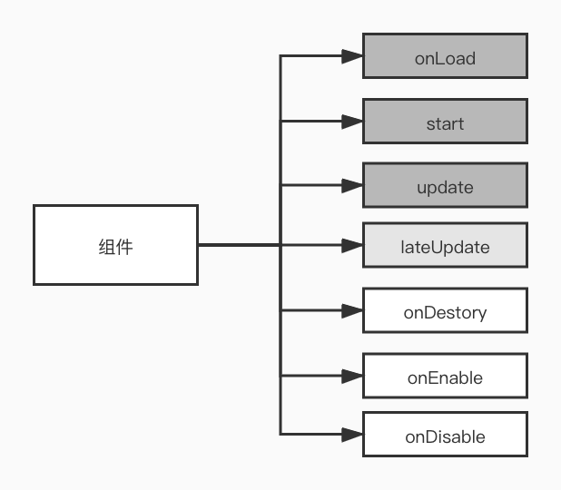
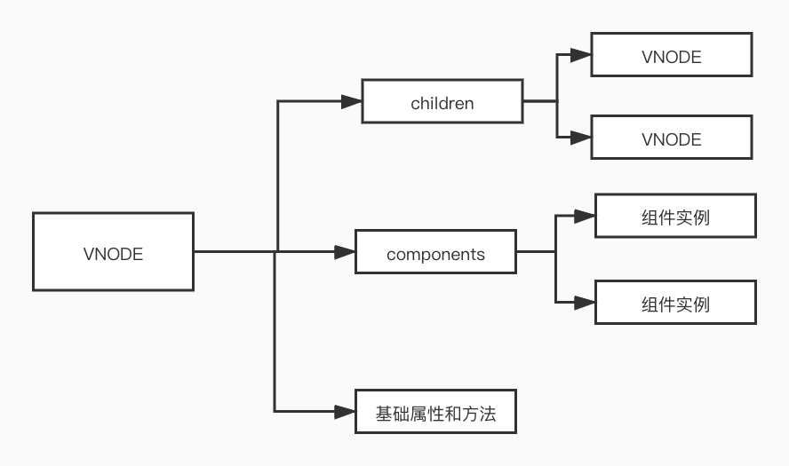

[cocos-creater](https://docs.cocos.com/creator/manual/zh/)是一款游戏开发框架的IDE，支持2d和3d游戏开发，入门简单，且支持跨平台

## 跨平台原理

市面上大多数的跨平台框架实现原理类似，内部实现一套标准的VNODE，通过不同平台的render，产出跨平台的代码。

## 组件

cocos的核心就是组件，通过不同的组件，赋予node不同的功能，比如内置的Sprite等。

## 生命周期

组件都有自己的生命周期，我的逻辑都是卸载生命周期中，一般用到的就是onLoad，start，和update

## 节点树

构成应用的核心就是一颗节点树，不同的节点发挥不同的功能，有些节点是功能性的，有些是布局性的，当然存在一些特殊的节点，后面有机会再介绍。

