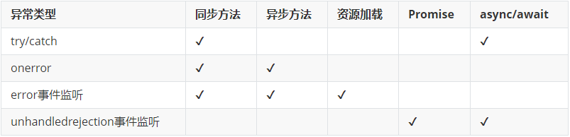

要设计一个前端错误监控系统，要解决的问题如下

- 错误哪里来
- 错误怎么收集
- 错误如何上报
- 错误如何存储
- 错误如何还原

## 错误哪里来

前端错误主要分为两大类，资源加载错误和脚本执行错误，资源指样式、脚本、图片、视频等等。

## 错误怎么收集

如下图所列举的，单一的错误收集无法满足需求



最终解决方案是：

```javascript
// 顶级错误收集
window.addEventListener('error', e => {
  console.log(e)
}, true)

// 将promise的错误上抛，async/await是promise的语法糖
window.addEventListener('unhandledrejection', e => {
  throw e.reason
})
```

对于一般的web应用程序，如上已经很好的解决来收集的问题，但是还有两大框架需要考虑

### vue的错误收集

根据vue的错误传播规则，如果全局的 config.errorHandler 被定义，所有的错误仍会发送给它

```javascript
Vue.config.errorHandler = e => {
  // 错误上报
}
```

[参考vue的errorCaptured](https://cn.vuejs.org/v2/api/#errorCaptured)

### react的错误收集

错误边界仅可以捕获其子组件的错误，它无法捕获其自身的错误。如果一个错误边界无法渲染错误信息，则错误会冒泡至最近的上层错误边界，这也类似于 JavaScript 中 catch {} 的工作机制

```javascript
class ErrorBoundary extends React.Component {
  constructor(props) {
    super(props);
    this.state = { hasError: false };
  }

  static getDerivedStateFromError(error) {
    // 更新 state 使下一次渲染能够显示降级后的 UI
    return { hasError: true };
  }

  componentDidCatch(error, errorInfo) {
    // 你同样可以将错误日志上报给服务器
  }

  render() {
    if (this.state.hasError) {
      // 你可以自定义降级后的 UI 并渲染
      return <h1>Something went wrong.</h1>;
    }

    return this.props.children; 
  }
}

<ErrorBoundary>
  <MyWidget />
</ErrorBoundary>
```

[参考React 16 引入了一个新的概念 —— 错误边界](https://react.docschina.org/docs/error-boundaries.html)

## 错误如何上报

在错误上报之前，首先得弄清楚，错误信息有哪些，以及什么时候上报

```json
{
  "type": "error",
  "target": "OBJECT",
  "message": "Uncaught ReferenceError: xxx is not defined",
  "filename": "http://xxx.com/error/error-log.js",
  "lineno": 12,
  "colno": 3,
  "error": {
    "stack": "", // 错误堆栈
    "message": "xxx is not defined"
  },
  "srcElement": "OBJECT"
}
```

上图列出了主要的字段，其中target是一个对象。在发生脚本错误时，是window对对象，资源加载失败的时候，是具体的资源加载标签，如link、img等，具体可以通过srcElement对象取到标签名

### 错误上报SDK

一般情况下，直接把error-log.js通过script引入页面即可，为了不错过收集阶段，最好在head的最开始位置引入。

但js的加载和执行肯定会影响页面的加载速度，正所谓锦上添花的时候最好不要去影响业务，我们可以用另外一种方式引入。

```javascript
// 直接在页面中内联错误收集
!(function(win) {
  win.ERROR_LOG = []
  window.addEventListener('error', () => {
  win.ERROR_LOG.push(arguments)
}, true)
})(window)
// 动态加载脚本
loadScript('error-log.js')
// 在脚本中将页面初始收集的信息win.ERROR_LOG上报
// 然后开启新的错误收集
```

## 错误如何存储

这里用log4js，未完待续。。。